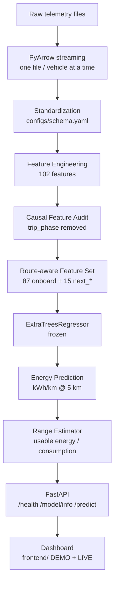
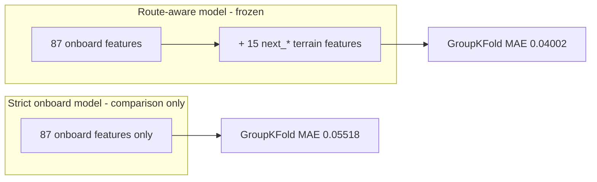

# Technical Architecture

This document describes the end-to-end architecture of the EV Energy
Consumption & Dynamic Range Prediction System, from raw telemetry to the
live dashboard.

## 1. System overview

The system is a single, frozen ML pipeline wrapped in a FastAPI service:

```
Telemetry (DEVRT / TUM / JAC raw files)
    ↓
PyArrow streaming (memory-safe, one file/vehicle at a time)
    ↓
Standardization (configs/schema.yaml)
    ↓
Feature Engineering (102 route-aware causal features)
    ↓
Causal Feature Audit (trip_phase removed)
    ↓
Route-aware Feature Set
    ↓
ExtraTreesRegressor (frozen)
    ↓
Energy Consumption Prediction (kWh/km over 5 km)
    ↓
Range Estimator (usable energy ÷ consumption, reserve, band)
    ↓
FastAPI (/health, /model/info, /predict)
    ↓
Dashboard (frontend/, DEMO + optional LIVE)
```



## 2. Modules

| Layer | Location | Responsibility |
|---|---|---|
| Data parsing | `src/data/` | DEVRT/JAC/TUM parsers, split creation, TUM extraction |
| Standardization | `configs/schema.yaml`, `src/data/schemas.py` | unified schema, unit normalization |
| Feature engineering | `src/inference/feature_builder.py` | 102-feature builder (runtime + training) |
| Causal audit | `src/analysis/step7_7_causal_audit.py` | leakage audit, feature causality |
| Model | `src/models/train_final_model.py`, `models/` | frozen ExtraTrees + preprocessor |
| Evaluation | `src/evaluation/` | leakage & split audits |
| Range estimation | `src/inference/range_estimator.py` | usable energy, reserve, uncertainty band |
| Inference service | `src/inference/service.py` | validation, feature build, predict, log |
| API | `api/main.py` | FastAPI endpoints + static dashboard |
| Dashboard | `frontend/` | real-time telemetry UI (DEMO + optional LIVE) |

## 3. Training pipeline

```
Parsed & standardized DEVRT
    → feature engineering (102 features, trip-level)
    → trip-level split (GroupKFold for selection; fixed holdout)
    → median imputation (fit on TRAIN+VALIDATION only)
    → ExtraTreesRegressor (random_state=42)
    → one-time held-out test evaluation (marker-protected)
    → freeze artifacts → models/
```

## 4. Inference pipeline (runtime)

```
POST /predict
  telemetry snapshot + route terrain
    → schema validation (pydantic)
    → feature builder (102 features)
    → preprocessor (median imputation) + model
    → predicted kWh/km
    → range estimator → conservative / expected / optimistic
    → JSON response + audit log
```

If no route provider is connected, the API uses the validated request-body
route terrain. The dashboard DEMO mode supplies a synthetic route provider
(clearly labeled); LIVE mode requires a real telemetry source.

## 5. Strict onboard alternative

A strict onboard-only model — trained without the 15 `next_*` route-aware
features — was evaluated for comparison. It performs **worse** on the held-out
test (GroupKFold MAE ≈ 0.05518 vs 0.04002 kWh/km route-aware). The onboard set
uses only signals available without any route/DEM knowledge:

- Current speed, altitude, motor/torque/RPM, SOC, capacity, ambient
  temperature, aux power, regen power, and past-window aggregates.

This alternative is documented to make the route-aware dependency explicit:
route/DEM elevation data must be available **before driving** for the best
model to be valid.



## 6. Memory-safe processing

- **PyArrow** columnar I/O — parquet streamed in row groups instead of loading
  whole CSVs.
- **One file/vehicle at a time** — trips processed independently, bounded
  working set.
- **Garbage collection** — explicit `gc` + tracemalloc during bulk processing.
- **No full TUM load** — the ~96 M-row TUM dataset is never fully loaded; peak
  processing RAM was ~197 MB (`reports/step11_memory_report.json`).

## 7. Deployment

- **Docker**: `Dockerfile` (python:3.12-slim, non-root `appuser`, healthcheck)
  + `docker-compose.yml`. Runtime deps pinned in `requirements.inference.txt`.
- **Local**: `uvicorn api.main:app --host 0.0.0.0 --port 8000`.
- **Dashboard**: served by the API at `/dashboard/`; DEMO by default, LIVE
  only with a real telemetry source (`?live=1&telemetry=...`).

## 8. Data flow guardrails

- **Leakage prevention**: trip-level splits, GroupKFold, future-target
  separation, causal audit, `trip_phase` removal.
- **No secrets**: API config is environment-driven, no hardcoded credentials.
- **No raw datasets in Docker**: images copy only `src/`, `api/`, `models/`,
  `frontend/` and requirements; raw telemetry stays on disk outside the image.