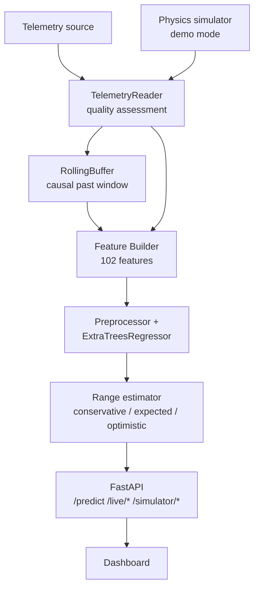

# Technical Architecture

This document describes the architecture of the EV Energy Consumption &
Dynamic Range Prediction System: a single frozen ML pipeline wrapped in a
FastAPI inference service, with a physics simulator for demo mode and an
optional LIVE telemetry layer.

## 1. System overview

```
Telemetry (SIMULATOR or LIVE source) + route terrain
        ↓
FastAPI (/health, /model/info, /predict, /live/*, /simulator/*)
        ↓
Schema validation (pydantic, payload-size limit)
        ↓
Feature Builder (102 route-aware causal features)
        ↓
Frozen preprocessor (median imputation) + ExtraTreesRegressor
        ↓
Energy consumption prediction (kWh/km over 5 km)
        ↓
Range estimator (usable energy ÷ consumption, reserve, band)
        ↓
Dashboard (SIMULATOR + optional LIVE) + inference audit log
```



## 2. Modules

| Layer | Location | Responsibility |
|---|---|---|
| Inference service | `src/inference/service.py` | validate, build features, predict, log |
| Feature builder | `src/inference/feature_builder.py` | 102-feature builder (runtime + training) |
| Predictor | `src/inference/predictor.py` | model load, residual quantiles, preprocessor |
| Range estimation | `src/inference/range_estimator.py` | usable energy, reserve, uncertainty band |
| Schemas | `src/inference/schemas.py` | pydantic request/response models |
| API | `api/main.py` | FastAPI endpoints + static dashboard |
| Telemetry | `src/telemetry/` | adapters, reader, quality, buffer, normalizer, recorder |
| Monitoring | `src/monitoring/` | OOD, drift, sensor-quality rules |
| Simulator | `src/simulator/` | physics-based demo scenarios (labeled SIMULATOR) |
| Model artifacts | `models/` | frozen model, preprocessor, feature list |
| Training tooling | `scripts/comprehensive_feature_engineering.py`, `src/data/devrt_parser.py`, `src/models/train_final_model.py`, `src/evaluation/` | reproduce/verify the frozen model |

## 3. Inference pipeline (runtime)

```
POST /predict
  telemetry snapshot + route terrain (+ optional causal past window)
    → schema validation (pydantic, numeric ranges, payload ≤ 1 MB)
    → feature builder (102 features)
    → frozen preprocessor (median imputation) + model
    → predicted kWh/km (may be ≤ 0 on net-regen segments → range 0.0)
    → range estimator → conservative / expected / optimistic
    → JSON response + audit log (request ID)
```

No route provider connected? `/predict` uses the validated `route_terrain`
from the request body. The dashboard SIMULATOR mode supplies a clearly-labeled
synthetic route provider; LIVE mode requires real route/DEM elevation.

## 4. Simulator (demo)

`src/simulator/` produces causally-correct demo telemetry:

- **Scenarios** (`scenario.py`) — seeded, deterministic route + driver profiles.
- **Physics** (`physics.py`) — speed profiles with a creep floor and a
  low-speed regenerative-braking fade (no regen below 8 km/h, full at
  25 km/h), so SOC / energy behavior is realistic.
- **Route** (`route.py`) — elevation profile with an ahead-horizon window for
  the route-aware `next_*` features.
- **Energy balance** — simulated consumption/regen is tracked and validated.

All simulator output is labeled `SIMULATOR` / `SIMULATOR_ROUTE` and is never
presented as real vehicle data. See `reports/step16_simulator_validation.md`.

## 5. LIVE telemetry layer

- **Adapters** (`src/telemetry/`) — OBD-II, CAN, and telematics sources behind
  a common `TelemetrySource` interface. No fabricated values.
- **Reader** (`reader.py`) — continuous, non-blocking sampling with per-signal
  quality assessment (VALID / STALE / MISSING / INVALID / OUT_OF_RANGE /
  UNAVAILABLE).
- **Buffer** (`buffer.py`) — rolling causal past window for windowed features.
- **Quality / normalizer** — range validation, unit normalization, staleness
  rejection.
- **Monitoring** (`src/monitoring/`) — OOD detection and PSI drift vs
  train+validation reference statistics; sensor-quality rules.

LIVE prediction requires `soc_pct` and `vehicle_speed_kmh` VALID and fresh
plus route terrain; otherwise the API returns an explicit status rather than
fabricating data.

## 6. Data-flow guardrails

- **Leakage prevention** — trip-level splits, GroupKFold, future-target
  separation, causal feature audit, `trip_phase` removed.
- **No fabricated data** — SIMULATOR data is labeled; LIVE data is real or
  reported offline; terrain is real or unavailable.
- **No secrets** — environment-driven config only.
- **Runtime images** ship only `src/`, `api/`, `scripts/`, `models/`, and the
  dashboard bundle; raw datasets stay local.
- **Frozen artifacts** — SHA-256 of model, preprocessor, and feature list are
  recorded and re-verified (`reports/step13_model_integrity.json`,
  `reports/step16_final_integrity.json`).
